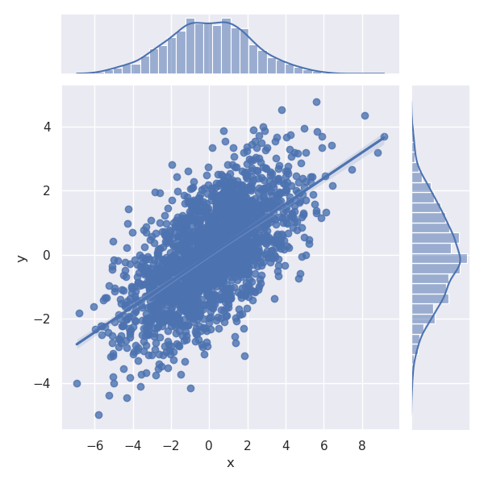
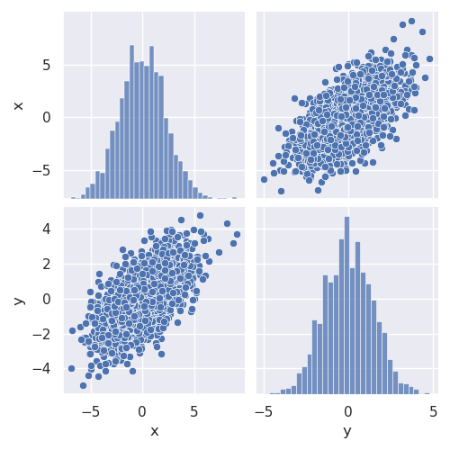

# Seaborn Cheat Sheet

| Method	| Example Code				| Description				| Example Plot				|
|---------|---------------------|-------------------|----------------------|
| sns.set	| sns.set()				| Use sns style for plotting		| 	|
| sns.kdeplot	| sns.kdeplot(data['x']. fill=True 	| Plot PDF distribution			| 	|
| sns.displot	| sns.displot(data=data, x="x", y="y", kind='kde') | Plot distribution plot of various kinds | 	|
| sns.histplot	| sns.histplot(data['x'])	        | Plot a simple histrogram     	       | 	|
| sns.jointplot	| sns.jointplot(data, x="x", y="y", kind='reg') | Plot a joint distribution along with optional linear fit | 	|
| sns.pairplot	| sns.pairplot(data)  	     	    	| Plot pariwise plots of all features in a data   | 	|
| sns.FacetGrid	| g = sns.FacetGrid(tips, row="sex", col="time", margin_titles=True)   g.map(sns.kdeplot, "pct")	| Create a custom grid of plots | 	|
| sns.catplot	| g = sns.catplot(data=tips, x="day", y="total_bill", hue="sex", kind="box") | Make bar plots of different kinds	| 	|
