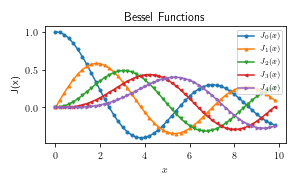
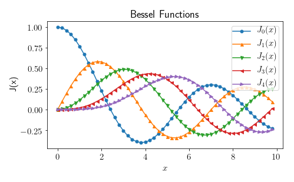
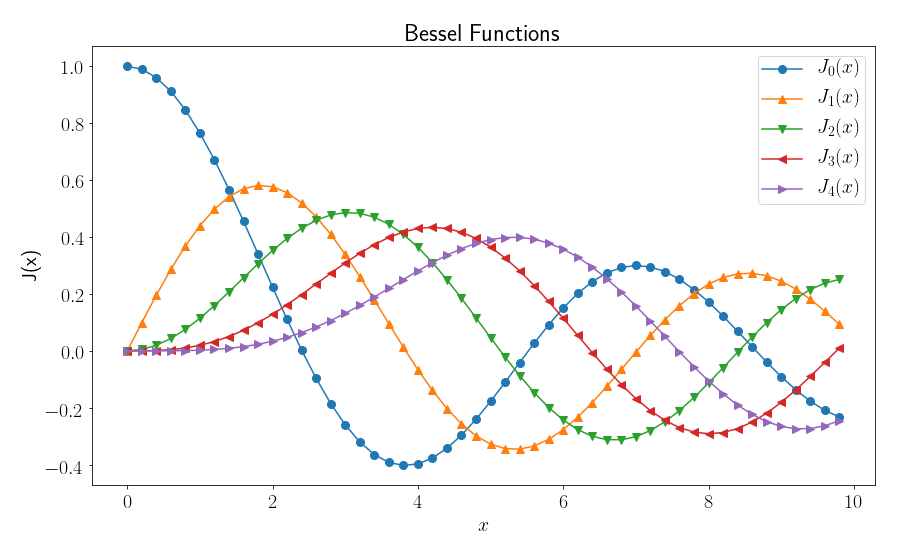

# Generating publishable quality plots in Python

I use python-pylab, a python interface to matplotlib to generate plots.

This page describes how to produce publishable quality plots (that can
embed LaTeX symbols) using python-pylab and Matplotlib.

Here you will find a simple module
[plot_settings.py](plot_settings.py) that can be used to set pylab
plot settings and generate different sized publishable quality images
very conveniently.

## How to use
Here is how to use this module:
```python
import pylab
import plot_settings as ps

# set appropriate plot size (small/medium/large) using ps before
# generating the plot with pylab

ps.setSmallSize() # generate a small size image
pylab.figure(1)
...

ps.setMediumSize()
pylab.figure(2)
...
```

## Example script

An example script [example_plots.py](example_plots.py) is provided
explaining how to use this module to generate plots. Here are some of
the plots generated using this script:



